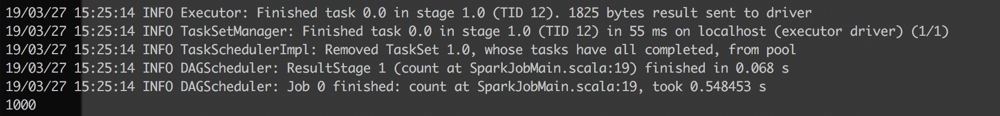
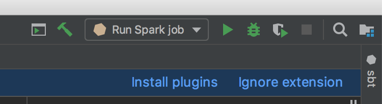
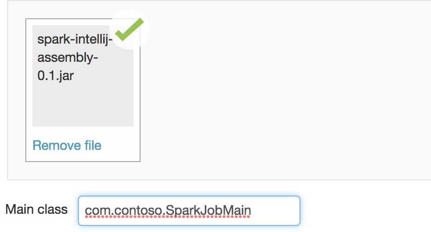
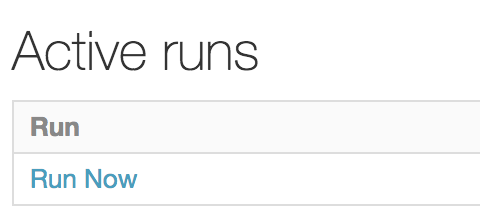
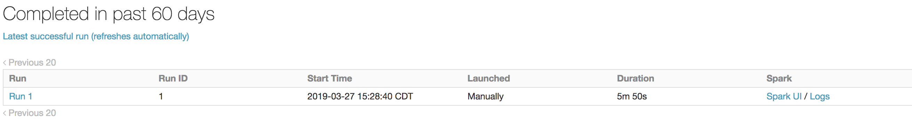

# Spark/Databricks Intellij Starter project

This project is a starting point for Spark projects that will eventually run on Databricks. This applies strictly to
Scala.

## Running locally

All the code resides in ``src/main/scala/com/contoso/SparkJobMain.scala``. The ``build.sbt`` file is the definition for
this project, telling the Scala Build Tool which packages to acquire. In our case, it also instructs the ``assembly``
plugin to omit the Spark library from your production JAR file, reducing the size tremendously.

In order to run this code locally, simply run ``sbt run`` on the command line. This should print out the number 1000, in
this example.

From within Intellij the ``Run Spark job`` command has already been defined for you if you want to run it within
the IDE itself.

## Assembling JAR for Databricks

This project includes the ``assembly`` plugin. This assembles a thin JAR file for use in Job clusters.

To build the JAR file, use ``sbt assembly`` on the command line. You can also use the ``Build JAR file`` task in
Intellij. This will produce the JAR file ``target/scala-2.11/spark-intellij-assembly-0.1.jar``

## Running in Databricks

Create a new job in the Jobs section of your Databricks workspace

Give it a name and click on ``Set JAR``:

Navigate to the JAR we generated above and select it. You'll need to put the path to the Main class in there as well.

Once done you have the option to start the run right away just below:

Databricks will start a cluster for you and run your job code. You can follow along with the logs in the ``Active Runs`` section.

